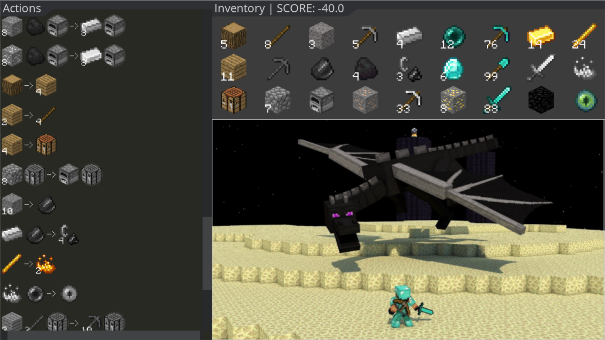
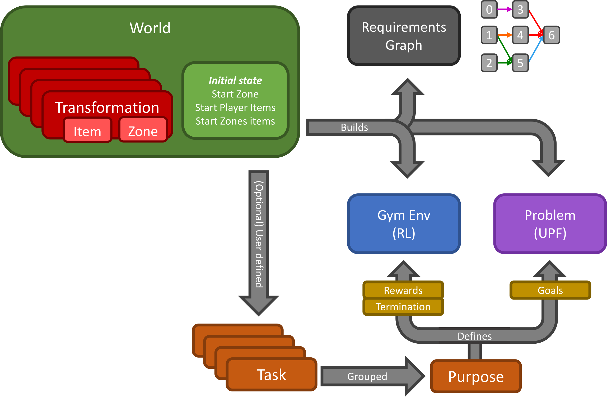

# Summary
Hierarchical reasoning remains one of the most fundamental challenges in artificial intelligence. Current methods still demonstrate failure in the face of tasks considered hierarchical and yet no metrics exist to properly quantify how hierarchical a task is. Existing environments only allow for few specific hierarchies to be tested and rely on non-trivial feature extractions requiring heavy computational resources.

We introduce **HierarchyCraft**, a builder for lightweight environments in which arbitrary hierarchical reasoning tasks without feature extraction can be created within a single library. HierarchyCraft  provides a set of environments and makes it easy to build custom hierarchical environments to fit any research needs.

For example, the effects of the underlying hierarchy of Minecraft can be studied with the MineHcraft environment that mimics the sub-tasks of Minecraft without feature extraction. A view of the graphical interface common to all HierarchyCraft environments is shown in Figure \autoref{fig:MineHcraft-dragon}.

## Design goals

HierarchyCraft aims to be a fruitful tool for studying hierarchical reasoning by focusing on the following design goals:

### Hierarchical by design
The action space being composed of sub-tasks instead of detailed movements and controls, any behaviour can be naturally decomposed into sub-tasks, rendering HierarchyCraft environments hierarchical by nature.

### No feature extraction needed
Compared to benchmarks that return grids, pixel arrays, text or sound, HierarchyCraft directly return a low-dimensional latent representation that doesn't need to be learned.
Therefore we save compute time and allow researchers to focus only the the hierarchical reasoning part while also permitting to use classical planning frameworks.

### Easy to use and customize
HierarchyCraft is a generic framework facilitating the creation of diverse hierarchical environments.
The library is simple and flexible thus enables researchers to define their own hierarchical environments. A detailed creation of an environment is provided in the documentation.
To showcase the diversity of environments that can be created within HierarchyCraft several examples are provided.

### Compatible with domains frameworks
HierarchyCraft environments are directly compatible with both reinforcement learning via  OpenAI Gym [@openai:2016] and planning via the Unified Planning Framework [@UPF:2023] or via PDDL [@pddl:1998], making it easy to be used by both the reinforcement and planning communities.

### Iteration speed
HierarchyCraft is lightweight and cheap compute. This is due to the absence of feature extraction required. Because the agent do not needs to learn complex feature extractions, it can converge rapidly even without aplenty computational resources at hands.

# Statement of need
HierarchyCraft is an easy to use Python library designed to build environments that can be used to study hierarchical reasoning in the contexts of reinforcement learning, classical planning and program synthesis as displayed in Figure \autoref{fig:HierachyCraft_domain_position}.

{ width=60% }

We argue that arbitrary hierarchical complexity can emerge from simple rules yet no metric exists to quantify this phenomenon. Studying and quantifying the effects of different hierarchical structures on learning agents should be a priority for hierarchical reasoning. Still existing reinforcement learning benchmarks considered hierarchical are not only challenging because of their underlying hierarchical structure but also because of the feature extraction and representation learning required. To our knowledge nothing exists to strictly study the hierarchical structure itself, that is why we built HierarchyCraft.

## Related works

Most of recent hierarchical reinforcement learning environments require researchers to have significant computational resources at hand and only tests the agent under a singular fixed hierarchy. This limits their ability to study the direct impact of the underlying hierarchical structure of the environment on the learning agent. We compare seven particularly related benchmarks to HierarchyCraft.

### Minecraft

One of the best examples of a hierarchical tasks is the collection of diamonds in the popular video game Minecraft as illustrated by @milani2020minerl:2020.
Inspired by the historically well-selling video game Minecraft, several pioneers have developed Minecraft-like environments, such as @johnson2016malmo:2016 and @guss2021minerl:2021.

Due to the sparse rewards, exploration difficulty, and long time horizons in this procedurally generated sandbox environment, only the recenty @dreamerv3:2023 became the first to collect diamonds in Minecraft from scratch.
Unfortunately, DreamerV3 needs to be trained on Nvidia V100 GPU for 17 days, gathering around 100 million steps.
Such **tremendous computational resources** are not accessible to most researchers, slowing the general progress of research on hierarchical reasoning.

### Crafter

Crafter by @hafner2021benchmarking:2021 is a lightweight grid-based 2D environment, with similar game mechanics as Minecraft and poses substantial challenges including exploration, representation learning, rewards sparsity and long-term reasoning.
Even tough Crafter indicates 22 achievements mapping to 22 different tasks (like “collect stone”, “place stone”), the relation between items is fixed and thus, **the underlying hierarchical structure of the environment is fixed** preventing researcher to study the effects of changes in this structure on the learning agent.

### GridWorld

GridWorld is a 2D grid based class of environments. It is frequently facilitated in hierarchical reinforcement learning research, such as in the Option framework by @sutton1999between:1999, where a goal has to be found in four rooms connected by hallways. Minigrid by @minigrid:2018 allows to build more complex cases and can be somewhat hierarchical by adding more rooms and keys, or obstacles such as lava. However, most GridWorld environments only describes **shallow and fixed hierarchies**.

### Arcade learning environment (Atari)

The arcade learning environment by @ALE:2013 is one of the most famous gold standard benchmarks in reinforcement learning composed of around 54 Atari games. Similar to the Minecraft benchmark, atari games **require powerful computational resources**, which substantially slow down experiments.
However, **only a few games require hierarchical reasoning** (like Montezuma's Revenge, Pitfall, etc.). Similar to MineRL, the agent still needs extra computational cost to extract the features from pixel returns. Similar to Crafter, each Atari games has a fixed hierarchies that cannot be modified.
Moreover, the usage of the arcade learning environment by the research community has been critizied by @machado2018revisiting:2018 considering problems they consider to remain open even after five years of fruitful use of the acrade learning environement.

### NetHack Learning Environment (NLE)

The NetHack learning environment by @kuttler2020nethack:2020 is based on the game NetHack where the observation a grid composed of hundreds of possible symbols.
Large amount of items are randomly placed in each level making NetHack extremely complex and challenging. NetHack is **too complex for agents to learn**, they indeed require many environment steps for agents to acquire domain-specific knowledge, 10B steps were required for the NeurIPS 2021 NetHack challenge by @hafner2021benchmarking:2021. Moreover, the NetHack game has only a **fixed underlying hierarchy** that cannot be easily modified.

### DeepMind Lab

DeepMind lab by @deepmindlab:2016 is a first-person 3D game platform designed for AI research, which can test agents with complex tasks in large, partially observed, and visually diverse worlds. While providing flexible API to allow users design new tasks, DeepMind Lab **require feature extraction** from images, preventing it to be represented in planning frameworks like most of the other previously described works.

### PDDLGym

PDDLGym by @pddlgym:2020 is a framework that automatically constructs Gym environments from Planning Domain Definition Language (PDDL) domains and problems. PDDL is a problem specification language introduced by @pddl:1998 for easy comparison of various symbolic planners in the AI planning community. PDDLGym offers a compact symbolic language for describing domains, which facilitates the creation of numerous, diverse benchmarks for sequential decision-making. However, in PDDLGym, actions space are detailed templates grounded with objects (e.g. $pick(plate)$). Building from such detailed templates makes it **difficult to use for creating hierarchical environments** specifically and time-consuming for researchers who are not familiar with PDDL-like languages. Moreover, PDDLGym is **only compatible with PDDL1** and does not suppoert `numeric-fluents` introduced in PDDL2.1 that are required to represent HierarchyCraft environments.

# Acknowledgements

This work was financed by The Intelligent Robot Learning Laboratory (IRL Lab), University of Alberta, Canada.

This work was also made possible by the research program of the engineering cursus at CentraleSupelec, University of Paris-Saclay, France

# References