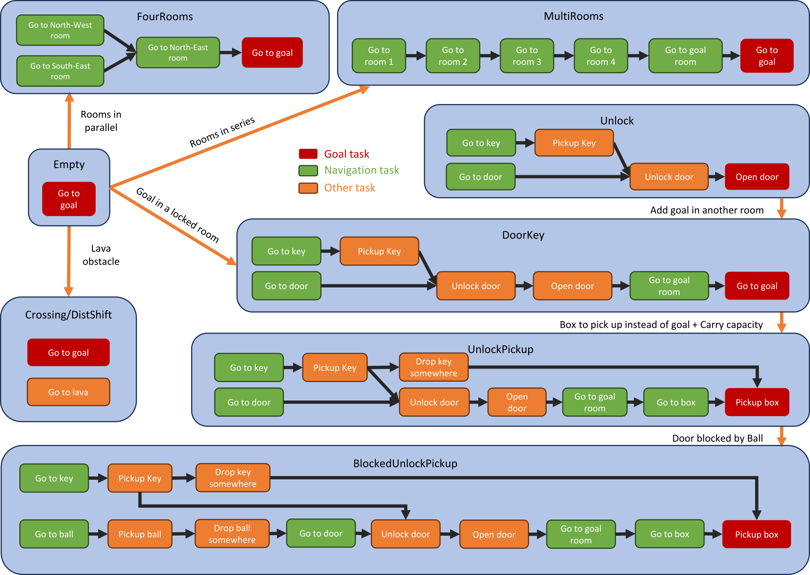
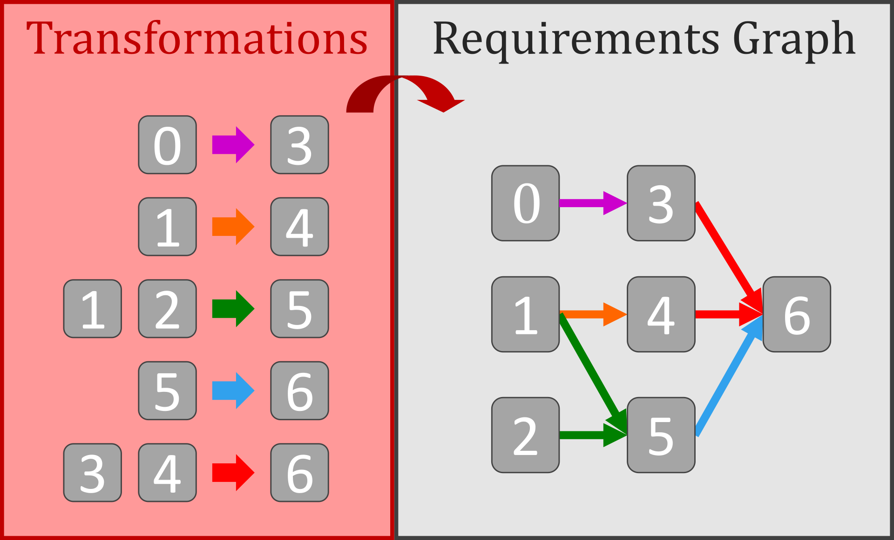
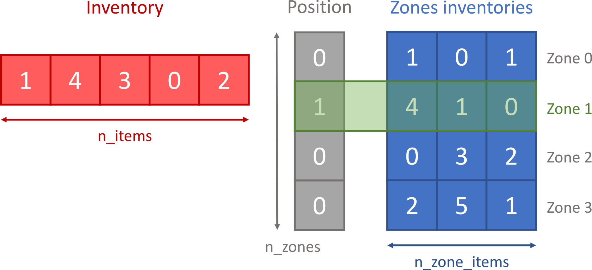

# Summary
Hierarchical reasoning poses a fundamental challenge in the field of artificial intelligence. Existing methods may struggle when confronted with hierarchical tasks, yet there is a scarcity of suitable environments or benchmarks designed to comprehend how the structure of the underlying hierarchy influence a task difficulty. Our software represents a crucial initial step in the development of tools aimed at addressing research questions related to hierarchical reasoning.

We introduce **HierarchyCraft**, a lightweight environment builder designed for creating hierarchical reasoning tasks that do not necessitate feature extraction. This includes tasks containing pixel images, text, sound, or any data requiring deep-learning based feature extraction.
HierarchyCraft serves a dual purpose by offering a set of pre-defined hierarchical environments and simplifying the process of creating customized hierarchical environments.

{ width=75% }

# Statement of need
HierarchyCraft is designed as a user-friendly Python library for constructing environments tailored to the study of hierarchical reasoning  in the contexts of reinforcement learning, classical planning, and program synthesis as displayed in \autoref{fig:HierachyCraft_domain_position}.

Analysis and quantification of the impacts of diverse hierarchical structures on learning agents is essential for advancing hierarchical reasoning.
However, current hierarchical benchmarks often limit themselves to a single hierarchical structure per benchmark, and present challenges not only due to this inherent hierarchical structure but also because of the necessary representation learning to interpret the inputs.

We argue that arbitrary hierarchical complexity can emerge from simple rules without the need for learning a representation.
To the best of our knowledge, no general frameworks currently exist for constructing environments dedicated to studying the hierarchical structure itself, underscoring the necessity for the development of tools like HierarchyCraft.
We compare five particularly related benchmarks to HierarchyCraft.

### GridWorld

GridWorld, a general class of 2D grid-based environments, is frequently utilized in hierarchical reinforcement learning research, notably within the options framework [@sutton1999between].

Minigrid [@minigrid] is a user-friendly Python library that not only implements a GridWorld engine but also expands its capabilities. This allows researchers to create more intricate scenarios by introducing additional rooms, objectives, or obstacles, as illustrated in  \autoref{fig:MinigridHierarchies}. Unfortunately, GridWorld environments typically exhibit a **limited hierarchical structure** and primarily focus on navigation tasks.

{ width=100% }

### Minecraft

An exemplary instance of a hierarchical task is the collection of diamonds in the popular video game Minecraft, as showcased in the MineRL competition [@guss2021minerl2020], where hierarchical reinforcement learning agents have dominated the leaderboard[@milani2020minerl2019].

Due to the sparse rewards, exploration difficulty, and long time horizons in this procedurally generated sandbox environment, DreamerV3 [@dreamerv3] recently became the first algorithm to successfully collect diamonds in Minecraft without prior training or knowledge.
Unfortunately, DreamerV3 required training on an Nvidia V100 GPU for 17 days, gathering around 100 million environmental steps.
Such **substantial computational resources are inaccessible to most researchers**, impeding the overall progress of research on hierarchical reasoning.

Moreover, although Minecraft has a undeniably complex hierarchical structure, **this underlying hierarchical structures is fixed** and cannot be modified without modding the game, a complex task for researchers.

### Crafter

Crafter [@hafner2022benchmarking] presents a lightweight grid-based 2D environment, with game mechanics akin to Minecraft and poses similar challenges including exploration, representation learning, rewards sparsity and long-term reasoning.
Although Crafter offers 22 different tasks displayed in \autoref{fig:CrafterRequirements}, the **fixed underlying hierarchical structure** restricts how researchers can investigate the impacts of changes in this structure.

Furthermore, the tasks considered by the authors do not include navigation subtasks (e.g., Find water, look for a cow, wait for a plant to grow, go back to a table...) or certain optional but useful subtasks (e.g., Swords and the skill of dodging arrows contribute to making the task of killing skeletons easier.), leading to abrupt drops in success rates in the hierarchy instead of a more gradual increase in difficulty.

![Partial Hierarchical structure of the Crafter environment. Inspired from Figure 4 of [@hafner2022benchmarking]\label{fig:CrafterRequirements}](docs/images/CrafterRequirementsGraph.png){ width=80% }

### PDDLGym

PDDLGym [@PDDLgym] is a Python library that automatically constructs Gym environments from Planning Domain Definition Language (PDDL) domains and problems. PDDL [@PDDL] functions as a problem specification language, facilitating the comparison of different symbolic planners. However, constructing PDDL domains and problems with a hierarchical structure is challenging and time-consuming, especially for researchers unfamiliar with PDDL-like languages.
Additionally, PDDLGym is **compatible only with PDDL1** and does not support numeric-fluents introduced in PDDL 2.1 that are required to represent quantities in the inventories of HierarchyCraft environments.

<!-- ### NetHack Learning Environment

The NetHack learning environment [@kuttler2020nethack] is based on the game NetHack, where the observation is a grid composed of hundreds of possible symbols.
Large numbers of items are randomly placed in each level, making NetHack extremely complex and challenging. In fact, NetHack is **too complex for agents to learn**, it requires many environment steps for agents to acquire domain-specific knowledge. 10B steps were required for the NeurIPS 2021 NetHack challenge [@2021NetHack], making it impractically long for a benchmark. Moreover, the NetHack game also has a **fixed underlying hierarchy** that cannot be easily modified. -->

### Arcade Learning Environment (Atari)

The arcade learning environment [@ALE] stands as a standard benchmark in reinforcement learning, encompassing over 55 Atari games. However, **only a few of these games, such as Montezuma's Revenge and Pitfall, necessitate hierarchical reasoning**. Each Atari games has a **fixed hierarchy that cannot be modified** and agents **demand substantial computational resources** to extract relevant features from pixels or memory, significantly slowing down experiments.

## Design goals

HierarchyCraft aims to be a fruitful tool for investigating hierarchical reasoning, focusing on achieving the following four design goals.

### 1. Hierarchical by design
The action space of HierarchyCraft environments consists of sub-tasks, referred to as *Transformations*, as opposed to detailed movements and controls. But each *Transformations* has specific requirements to be valid (eg. have enought of an item, be in the right place), and these requirements may necessitate the execution of other *Transformations* first, inherently creating a hierarchical structure in HierarchyCraft environments.

This concept  is visually represented by the *Requirements graph* depicting the hierarchical relationships within each HierarchyCraft environment.
The *Requirements graph* is directly constructed from the list of *Transformations* composing the environement, as illustrated in \autoref{fig:TransformationToRequirements}.

Requirements graphs should be viewed as a generalization of previously observed graphical representations from related works, including  \autoref{fig:CrafterRequirements} and \autoref{fig:MinigridHierarchies}.

{ width=75% }

### 2. No feature extraction needed
In contrast to benchmarks that yield grids, pixel arrays, text, or sound, HierarchyCraft directly provides a low-dimensional latent representation that does not require learning, as depicted in \autoref{fig:HierarchyCraftState}.
This not only saves computational time but also enables researchers to concentrate on hierarchical reasoning while additionally  allowing for the utilization of classical planning frameworks such as PDDL [@PDDL] or ANML [@ANML].

{ width=80% }

### 3. Easy to use and customize
HierarchyCraft is a versatile framework enabling the creation of diverse hierarchical environments.
The library is designed to be simple and flexible, allowing researchers to define their own hierarchical environments with detailed guidance provided in the documentation.
To showcase the range of environments possible within HierarchyCraft, multiple examples are provided.

### 4. Compatible with domains frameworks
HierarchyCraft environments are directly compatible with both reinforcement learning through Gymnasium [@gymnasium] and planning through the Unified Planning Framework [@UPF] (see \autoref{fig:HierarchyCraft-pipeline}).
This compatibility facilitates usage by both the reinforcement learning and planning communities.

{ width=80% }

# Acknowledgements

This work was made possible by the research program of the engineering cursus at CentraleSupelec, University of Paris-Saclay, France.

The research was conducted at the Intelligent Robot Learning (IRL) Lab, University of Alberta, which is supported in part by research grants from the Alberta Machine Intelligence Institute (Amii); a Canada CIFAR AI Chair, Amii; Compute Canada; Huawei; Mitacs; and NSERC.

Special thanks to Laura Petrich and other members of the IRL Lab for there assistance in finding and describing related works, their critical thinking on the project, and their contributions to the revisions of the documentation and report.

# References
